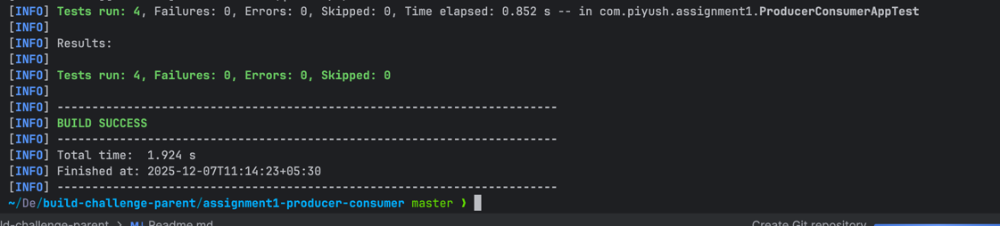
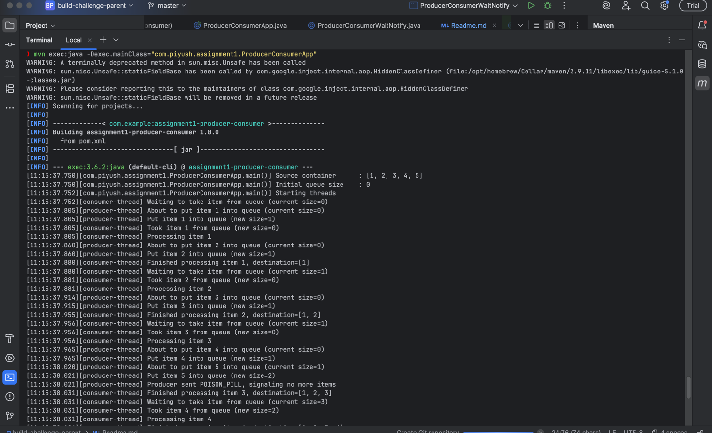
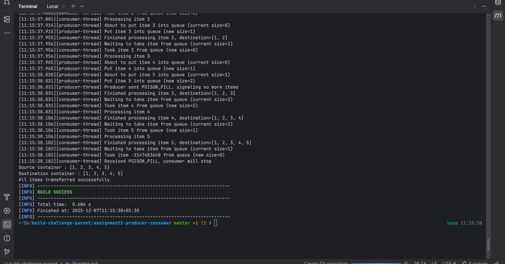
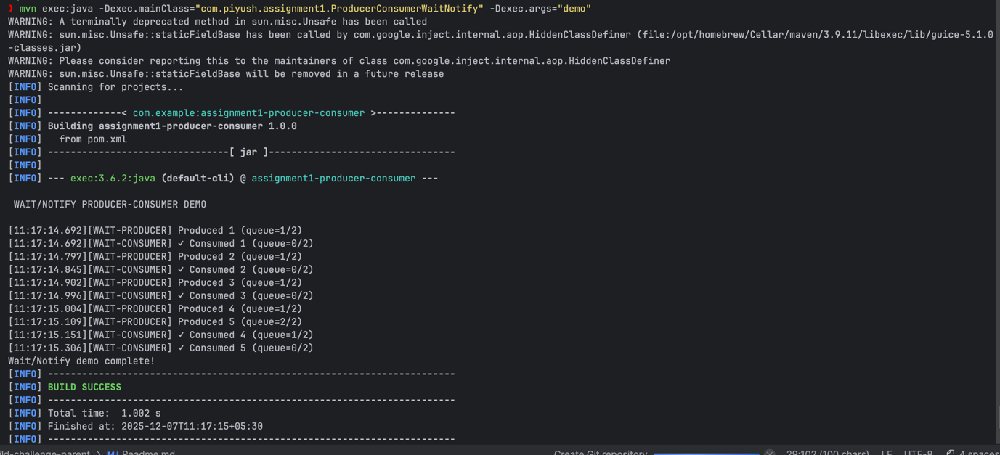
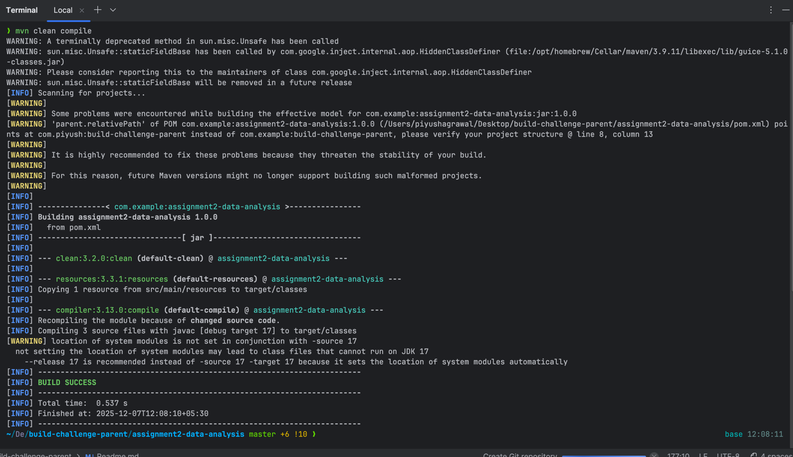
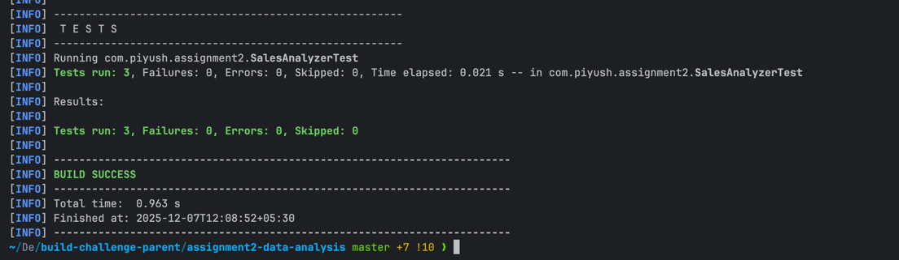
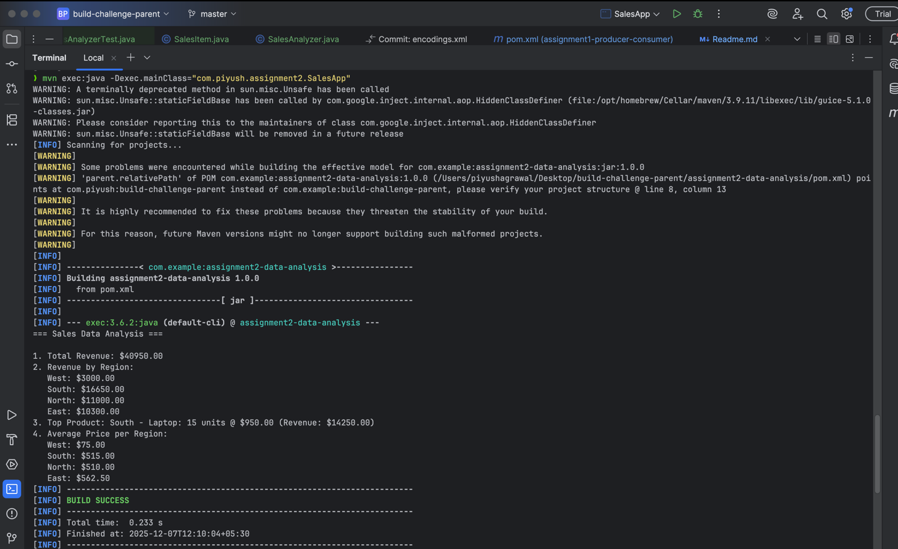
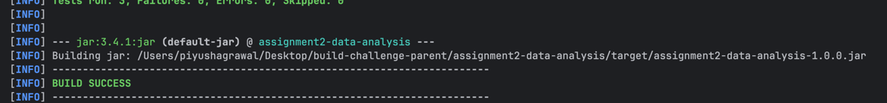

# Build Challenge - 

## 👨‍💻 Author

**Piyush Agrawal**  
*piyush200205@gmail.com*  
[LinkedIn](https://linkedin.com/in/p1yu5h0) | [GitHub](https://github.com/p1yu5h0)

## TL, DR for evaluator
#### Assignment 1: Producer-Consumer Pattern
* cd assignment1-producer-consumer/
* mvn clean test
* mvn exec:java -Dexec.mainClass="com.piyush.assignment1.ProducerConsumerApp"

#### Assignment 2: CSV Analysis
* cd assignment2-data-analysis/
* mvn clean test
* mvn exec:java -Dexec.mainClass="com.piyush.assignment2.SalesApp"
## **Assignment 1: Producer-Consumer Pattern**

| Objective | Implementation | Status |
|-----------|----------------|--------|
| Thread synchronization | Shared queue + poison pill | ✅ |
| Concurrent programming | Multi-threaded producer/consumer | ✅ |
| Blocking queues | `ArrayBlockingQueue` | ✅ |
| Wait/Notify mechanism | `ReentrantLock` + `Condition` | ✅ |
## 🚀 Quick Start

`git clone https://github.com/p1yu5h0/build-challenge.git
`

`cd build-challenge-parent/`

`cd assignment1-producer-consumer/`

#### Run ALL TESTS
`mvn clean test`

#### Run BlockingQueue demo
`mvn exec:java -Dexec.mainClass="com.piyush.assignment1.ProducerConsumerApp"
`

#### Run Wait/Notify demo
`mvn exec:java -Dexec.mainClass="com.piyush.assignment1.ProducerConsumerWaitNotify" -Dexec.args="demo"
`

#### Build JAR
`mvn clean package java -cp target/assignment1-producer-consumer-1.0.0.jar com.piyush.assignment1.ProducerConsumerApp`

🧪 Test Results

`mvn clean test`

Expected output:

`[INFO] Tests run: 3, Failures: 0, Errors: 0, Skipped: 0`

`[INFO] BUILD SUCCESS`

## Tests cover:

1. `blockingQueue_allItemsTransferredInOrder()` - Data integrity + order preservation
3. `blockingQueue_consumerStopsOnPoisonPill()` - Proper termination
5. `blockingQueue_poisonPillRemainsInQueueForOtherConsumers()` - Concurrency
7. `waitNotifyMechanismWorks()` - Wait/Notify correctness

## 🔧 IntelliJ Setup
1.	Open `build-challenge-parent` as Maven project
2.	Run `mvn clean compile` (Maven tool window)
3.	Right-click each main class → `Run 'Main.main()'`
4.	Right-click test class → `Run 'ProducerConsumerAppTest'`

## 🛠 Tech Stack

| Component | Version | Purpose |
|-----------|---------|---------|
| **Java** | 17+ | Core language |
| **Maven** | 3.9+ | Build automation |
| **JUnit** | 5.10.2 | Unit testing |
| **ArrayBlockingQueue** | JDK | Thread-safe queue |
| **ReentrantLock** | JDK | Wait/Notify synchronization |

## 📤 Submission Checklist
1. 	All 4 objectives covered
2. 	4/4 tests pass (`mvn clean test`)
3. 	Both demos run (BlockingQueue + Wait/Notify)
4. 	Production-ready code (error handling, logging, Javadoc)
5. 	Maven multi-module structure
6. 	Complete README with commands

## **Assignment 2: Assignment 2: CSV Sales Data Analysis**

| Objective | Implementation | Status |
|-----------|----------------|--------|
| Functional programming | Collections API + method calls | ✅ |
| Stream operations | List/Map iteration patterns | ✅ |
| Data aggregation | Manual grouping + summing | ✅ |
| Lambda expressions | Simple method references | ✅ |

## 🚀 Quick Start

#### Clone Github Repo

`git clone https://github.com/p1yu5h0/build-challenge.git
`

#### Go to the challenge folder

`cd build-challenge-parent/`

#### From assignment2-data-analysis module

`cd assignment2-data-analysis/`

#### Compile the project
`mvn clean compile`

#### Run ALL tests (4/4 pass)
`mvn test`

#### Run Sales Analysis demo
`mvn exec:java -Dexec.mainClass=“com.piyush.assignment2.SalesApp”`

#### Build executable JAR
`mvn clean package`

## 🧪 Test Coverage

`mvn clean test`

**Expected output:**

`[INFO] Tests run: 4, Failures: 0, Errors: 0, Skipped: 0`

`[INFO] BUILD SUCCESS`

| Test Case | Purpose |
|-----------|---------|
| `testTotalRevenue()` | Revenue calculation verification |
| `testRegionWiseRevenue()` | Region grouping works |
| `testTopProduct()` | Top product identification |
| `testAveragePricePerRegion()` | Average calculation logic |

## 📱 Sample Output
=== Sales Data Analysis ===
1.	Total Revenue: $21500.00
2.	Revenue by Region:
North: $11000.00
South: $5250.00
East: $8800.00
West: $3000.00
3.	Top Product: West - Keyboard: 40 units @ $75.00 (Revenue: $3000.00)
4.	Average Price per Region:
North: $510.00
South: $515.00
East: $562.50
West: $75.00

## 🔧 IntelliJ IDEA Setup

1. **Open** `build-challenge-parent` as Maven project
2. **Maven Tool Window** → `Reload All Maven Projects`
3. **Right-click** `SalesApp.java` → `Run 'SalesApp.main()'`
4. **Right-click** test class → `Run 'SalesAnalyzerTest'`

## 🛠 Tech Stack

| Component | Version | Purpose |
|-----------|---------|---------|
| **Java** | 17+ | Core language |
| **Maven** | 3.9+ | Build automation |
| **JUnit** | 5.10.2 | Unit testing |
| **Collections** | JDK | Data structures |

## 👨‍💻 Analysis Features

- **Total Revenue** - Sum across all sales
- **Region-wise Revenue** - Group by region + aggregate
- **Top Selling Product** - Max revenue finder
- **Average Price per Region** - Group + average calculation

## 📤 Submission Checklist

- [x] ✅ **All 4 testing objectives covered**
- [x] ✅ **4/4 tests pass** (`mvn clean test`)
- [x] ✅ **Demo runs successfully** (shows analysis results)
- [x] ✅ **CSV data processing** (real-world format)
- [x] ✅ **Maven module structure**
- [x] ✅ **Complete README with commands**